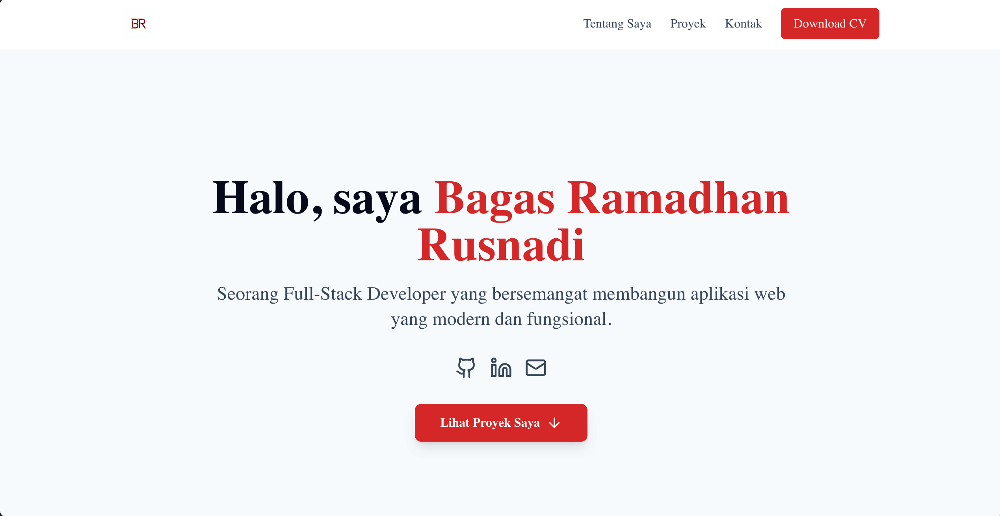

# Portofolio Pribadi v1 - [Nama Kamu]


---

Selamat datang di repositori website portofolio pribadi saya! 🚀 Website ini adalah "rumah digital" saya, tempat saya menampilkan proyek-proyek yang pernah saya kerjakan, skill yang saya kuasai, dan perjalanan saya sebagai seorang web developer.

Website ini dibangun dari nol menggunakan teknologi modern dengan fokus pada desain yang bersih, performa yang cepat, dan pengalaman pengguna yang menyenangkan.

**🔗 Link Portofolio:** [**bagasrr.my.id**](https://bagasrr.my.id)

---

### 📸 Screenshot



---

### ✨ Fitur Utama

- **🎨 Desain Modern & Responsif**: Tampilan yang optimal di berbagai perangkat, dari desktop hingga mobile.
- **🌙 Mode Gelap & Terang**: Mendukung preferensi sistem pengguna secara otomatis.
- **📜 Smooth Scrolling**: Navigasi antar bagian halaman yang mulus.
- **✨ Animasi Infinite Scroller**: Tampilan skill yang dinamis dan tidak monoton.
- **📂 Data Proyek Terpusat**: Informasi proyek dikelola secara terpusat dalam file `projects.json` agar mudah di-update.
- **🚀 Dibangun dengan Next.js App Router**: Memastikan performa yang sangat cepat (Server-Side Rendering) dan SEO-friendly.

---

### 🛠️ Teknologi yang Digunakan

- **Framework**: [Next.js](https://nextjs.org/) (App Router)
- **Library UI**: [React](https://reactjs.org/)
- **Bahasa**: [TypeScript](https://www.typescriptlang.org/)
- **Styling**: [Tailwind CSS](https://tailwindcss.com/)
- **Ikon**: [Lucide React](https://lucide.dev/)
- **Deployment**: [Vercel](https://vercel.com/)

---

### 🚀 Menjalankan Proyek Secara Lokal

Ingin mencoba proyek ini di komputermu? Ikuti langkah-langkah berikut:

**1. Clone Repositori**

```bash
git clone [https://github.com/](https://github.com/)[bagasrr]/[my-porto].git
cd [my-porto]
```

**2. Instal Dependensi**

Disarankan menggunakan pnpm atau yarn

```bash
pnpm install
```

tapi npm dan yarn juga bisa.

```bash
npm install
# atau
yarn install
```

**3. Jalankan Server Development**

```bash
pnpm dev
#atau
npm run dev
#atau
yarn dev
```

**3. Buka di Browser**
Buka http://localhost:3000 di browser untuk melihat hasilnya.
